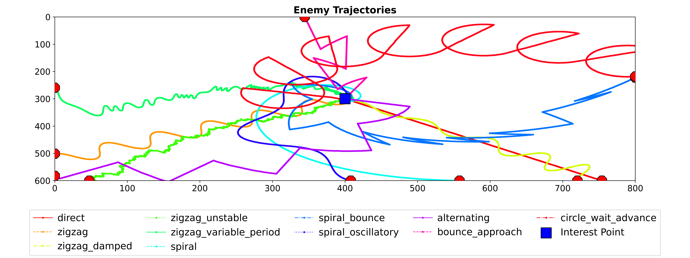

# Proposta e Avaliação de Algoritmo Distribuído para Enxame de Drones Defensivos baseado em Planejamento

## Motivação e Fundamentação Histórica
- A inspiração para este projeto surge da longa tradição da pesquisa operacional, que teve um papel decisivo durante a Segunda Guerra Mundial. Naquele período, a necessidade de otimizar recursos limitados – como tempo, espaço e vidas humanas – levou ao desenvolvimento de técnicas avançadas de tomada de decisão e alocação de recursos. Hoje, com o advento de drones de baixo custo e a facilidade de sua construção, o cenário de defesa se transformou. Sistemas centralizados tradicionais, que exigem infraestrutura complexa e dispendiosa, tornam-se vulneráveis diante de enxames de drones inimigos de baixo custo e baixa detectabilidade. Assim, a proposta deste projeto é desenvolver uma solução distribuída e colaborativa, onde cada drone amigo opera de forma autônoma e intercomunicada para defender um ponto de interesse estratégico.

- Essa abordagem distribuída permite uma resposta rápida e escalável, pois a rede ad hoc entre os drones possibilita a propagação de informações sem depender de um centro de comando único. Além disso, a proposta abre caminho para a futura integração com algoritmos de aprendizado por reforço, onde os drones podem ajustar suas estratégias com base em feedback contínuo, melhorando a eficiência da defesa ao longo do tempo.

## Abordagem Geral e Estrutura da Simulação

### 1. Critérios de Término do Episódio
Um episódio de simulação é finalizado sob três condições:

- Quando todos os drones inimigos são abatidos – o que é verificado na função `AirTrafficEnv::step`, onde a lista de `enemy_drones` é atualizada e drones eliminados são removidos do ambiente.

- Quando o ponto de interesse é destruído – isto ocorre quando a saúde (*health*) do ponto de interesse, controlada pela classe `CircleInterestPoint`, chega a zero, indicando que os ataques dos drones inimigos foram suficientes para comprometê-lo.

- Quando é atingido um limite máximo de passos de simulação – definido por `max_steps` (por padrão, 5000 passos), garantindo que a simulação seja finita e evitando loops infinitos.

### 2. Representação do Ambiente e dos Estados Internos

#### Área de Simulação
  - O ambiente é modelado em uma área bidimensional (2D) com dimensões definidas em `settings.py` (`SIM_WIDTH` e `SIM_HEIGHT`).

  - Essa área é discretizada em uma grade (usando `CELL_SIZE`, `GRID_WIDTH` e `GRID_HEIGHT`), permitindo a representação espacial das posições.

  - O ponto de interesse é representado pela classe `CircleInterestPoint`, que desenha um círculo com um raio interno (zona crítica) e um raio externo (limite de atuação dos drones amigos). A cor do círculo varia dinamicamente de verde a vermelho, conforme sua saúde diminui, o que reflete os danos acumulados.

#### Matrizes de Detecção
  - Cada drone mantém duas matrizes bidimensional que mapeiam a presença de drones amigos e inimigos – valores entre 0 e 1 indicam o quão recente foi detecção.

  - Essas matrizes são atualizadas constantemente pelas funções `update_local_enemy_detection` e `update_local_friend_detection` (implementadas na classe `Drone`), que utilizam a função `pos_to_cell` para converter a posição do drone para uma célula da grade.

  - A atualização da matriz inclui um mecanismo de decaimento exponencial (usando o `DECAY_FACTOR`) que diminui o valor das células com o tempo, representando a perda de relevância de informações antigas.

#### Matrizes de Direção
  - Além das matrizes de intensidade, os drones mantêm duas matrizes tridimensionais que registram os vetores de direção dos drones inimigos e amigos (cada célula da grade armazena duas corodenadas de vetor).

  - Esses vetores são calculados com base nas mudanças de posição detectadas (por exemplo, usando a normalização da variação entre posições consecutivas)
    e são essenciais para prever trajetórias e ajustar as respostas dos drones defensivos, sobretudo para a perseguição.

#### Informações Escalares
  - Cada drone armazena também sua própria posição e a posição do ponto de interesse, permitindo uma atualização contínua e autônoma do estado do ambiente.
  
#### Integração de Informações
  - Essas informações são combinadas para formar um estado completo que alimenta a tomada de decisão, tanto em ações de defesa quanto em atualizações de comunicação com os drones vizinhos.

### 3. Comportamento dos Drones Inimigos

#### Origem e Seleção de Trajetória
  - Na classe `EnemyDrone`, os drones inimigos são inicializados em posições aleatórias nas bordas da área de simulação, segundo a função `random_border_position`.

  - Se não for especificado um comportamento, o sistema escolhe aleatoriamente entre diversos padrões pré-definidos (como "*direct*", "*zigzag*", "*spiral*", "*alternating*", entre outros), garantindo diversidade e imprevisibilidade nos ataques.

  

  

#### Reação ao Contato com Drones Amigos
  - Quando um drone inimigo detecta um drone amigo dentro de um raio definido (`ENEMY_DETECTION_RANGE`), ele avalia um valor aleatório, comparando-o
  com o parâmetro de agressividade (`AGGRESSIVENESS`). Este valor é gerado com variável aleatória de distribuição uniforme.

  - Se o valor aleatório for menor que o parâmetro de agressividade, o drone entra em modo "`desperate_attack`", alterando sua velocidade para atacar
    diretamente o ponto de interesse. Essa decisão é imediata e representa uma reação agressiva.

  - Se o valor aleatório for maior, o drone ativa um modo de fuga: ele se desvia na direção oposta ao drone defensivo por um número fixo de passos (`ESCAPE_STEPS`) e depois retoma sua trajetória original. Essa mecânica simula um comportamento defensivo que evita confrontos diretos quando a situação não é favorável.

#### Atualizações e Controle de Limites
  - A função `EnemyDrone::update` é responsável por atualizar a posição, a velocidade e a trajetória do drone. Ela também assegura que o drone não ultrapasse os limites da área de simulação, ajustando sua posição caso seja detectada uma tentativa de sair dos limites (com verificações para x e y).

### 4. Comportamento dos Drones Amigos (Defensivos)

#### Posição Inicial e Configuração
  - Os drones amigos são inicializados em torno do ponto de interesse, frequentemente distribuídos em forma de polígono regular para cobrir uma área estratégica ao redor do alvo.

  - A classe `Drone` cuida de definir as propriedades iniciais, como a posição, a velocidade (inicialmente zero) e a cor (por padrão branca).

#### Comunicação e Coordenação
  - Cada drone amigo mantém uma rede de comunicação *ad hoc*, implementada na função `Drone::communication`. Quando drones estão próximos (dentro do `COMMUNICATION_RANGE`), eles compartilham suas matrizes de detecção, mesclando informações através dos métodos `merge_enemy_matrix` e `merge_friend_matrix`.

  - Esse processo permite que um drone que não tenha uma detecção direta de um inimigo ainda receba informações relevantes de seus pares, melhorando a precisão e a reatividade da defesa.

  - Adicionalmente, um mecanismo de eleição (via `start_election` e `receive_election`) pode ser utilizado para designar um líder, o que reforça a coordenação mesmo em um sistema distribuído.

#### Tomada de Decisão e Execução de Ações:
  - No modo "*planning*", implementado em `Drone::apply_behavior`, cada drone analisa sua matriz de detecção para identificar ameaças e priorizar a perseguição daquelas que estão mais próximas do ponto de interesse.

  - A função `Drone::take_action` utiliza os dados do ambiente para atualizar a posição do drone, garantindo que ele se mova de acordo com a estratégia definida, sem ultrapassar o `EXTERNAL_RADIUS` do ponto de interesse.

  - Se não houver ameaças, os drones entram em estado de "hold", permanecendo em sua posição enquanto continuam a atualizar suas informações e a se comunicar com outros drones. Nesse estado, o drone pode se movimentar, buscando uma posição favorável para prosseguir com a detecção, movendo-se em direção ao ponto de interesse até que se conecte a um drone amigo ou atinja a distância inicial do ponto de interesse, o que ocorrer primeiro.

#### Resultados das Interações:
Quando um drone amigo se aproxima de um inimigo, as interações podem resultar em três desfechos:

  1. O drone amigo neutraliza o inimigo sem sofrer danos, permitindo que continue operando.

  2. O inimigo neutraliza o drone amigo, geralmente por meio de uma ação explosiva, removendo ambos da simulação.
  
  3. O drone amigo sofre uma falha interna (simulação de danos ou escassez de recursos) e é removido, enquanto o inimigo continua sua aproximação.

Esses resultados são determinados por uma lógica probabilística implementada no ambiente (`AirTrafficEnv::step`), que também atualiza a saúde do ponto de interesse e a recompensa acumulada.

### 5. Métrica de Desempenho e Análise Comparativa

#### Acumulador de Recompensa
  - A clareza na definição da métrica de desempenho evidencia a importância de especificar o que se busca otimizar – um princípio fundamental em qualquer problema de otimização.

  - A eficiência da defesa é quantificada por um acumulador de recompensa, cuja atualização ocorre em `AirTrafficEnv::compute_reward`.

  - A recompensa em cada passo é calculada com base na soma das distâncias dos drones inimigos ao ponto de interesse, normalizadas por um fator (por padrão, 1/10000), e ajustada com bônus para inimigos abatidos e penalidades para ataques bem-sucedidos realizado por drone inimigo.

  - Esse acumulador fornece um indicador quantitativo da performance da defesa ao longo do tempo, permitindo comparações entre diferentes estratégias.

#### Comparações de Abordagens
A solução distribuída (proposta) é comparada com:
  1. Uma solução não cooperativa (benchmark), onde os drones operam sem comunicação entre si, confiando apenas em suas próprias detecções.

  2. Solução centralizada: cada drone amigo possui acesso total às informações do ambiente, permitindo que tome decisões de forma cooperativa com base nessa visão global comum. É importante ressaltar que, na abordagem proposta, os drones dispõem apenas de um estado parcial do ambiente, obtido por meio do compartilhamento de informações entre aqueles que estão na mesma partição da rede.

  - Testes estatísticos não-paramétricos (*Kolmogorov-Smirnov* e *Mann‑Whitney*) são planejados para analisar se as diferenças entre as abordagens são significativas, refutando ou não a hipótese nula de equivalência entre os métodos.

#### Perspectivas Futuras

  - Um próximo passo lógico é a incorporação de algoritmos de aprendizado por reforço, que permitiriam ao sistema adaptar e melhorar suas estratégias de defesa com base em experiências passadas, buscando tornar a rede de drones ainda mais eficiente e resiliente.

  - Essa integração não apenas potencializa a melhoria contínua do sistema, mas também abre novas perspectivas para a aplicação de técnicas avançadas de inteligência artificial em cenários de defesa.

### 6. Aspectos Inovadores

#### Rede Ad Hoc
  - Diferente dos sistemas centralizados, que dependem de um único ponto de falha e de infraestrutura cara, a rede *ad hoc* permite que cada drone amigo opere de forma autônoma, mas sincronizada, compartilhando informações e colaborando para uma defesa mais rápida e eficaz.

  - Essa abordagem distribuída reflete uma tendência moderna na defesa e na robótica, onde a cooperação entre agentes autônomos pode superar limitações inerentes aos sistemas centralizados.

#### Comparação com Soluções Tradicionais
  - A abordagem centralizada, onde cada drone recebe uma visão global do ambiente, pode oferecer mais acertividade no julgamento dos drones defensivos, mas frequentemente resulta em altos custos e baixa versatilidade.

  - Por outro lado, em uma abordagem não cooperativa – onde os drones operam sem compartilhar informações – há o risco de não detectar ameaças que se encontram fora de seu alcance imediato. Além disso, quando cada drone adota uma estratégia "*greedy*", priorizando exclusivamente sua própria recompensa (otimização local), o sistema pode acabar gerando soluções globais que vão de encontro ao objetivo da otimização.

  - A abordagem distribuída busca unir o melhor dos dois mundos: ela permite que os drones se comuniquem localmente para ampliar seu alcance de detecção e tomada de decisão, mantendo a agilidade e a robustez essenciais para um ambiente de defesa dinâmico. Dessa forma, evita-se os custos, as vulnerabilidades e os desafios logísticos inerentes a uma infraestrutura centralizada de detecção e comando e controle (C2).

## Resultados e Análises Preliminares

### Visualização da Simulação par a par

- benchmark (não cooperativo) vs. proposta (distribuída)

- benchmark (não cooperativo) vs. centralizado
  

- proposta (distribuída) vs. centralizado

### Teste de Normalidade (Shapiro-Wilk)

- benchmark (não cooperativo)

- proposta (distribuída)

- centralizado

### Teste não-paramétrico
Note que existem evidências suficientes para rejeitar a hipótese nula de normalidade das amostras. Por tanto, opta-se por realizar testes não-paramétricos para avaliar a diferença entre as abordagens.

#### Teste de Kolmogorov-Smirnov
Testa a hipótese nula de que duas amostras independentes são provenientes da mesma distribuição contínua.

- benchmark (não cooperativo) vs. proposta (distribuída)

- benchmark (não cooperativo) vs. centralizado

- proposta (distribuída) vs. centralizado

#### Teste de Mann-Whitney
Testa a hipótese nula de que duas amostras independentes têm a mesma mediana.

- benchmark (não cooperativo) vs. proposta (distribuída)

- benchmark (não cooperativo) vs. centralizado

- proposta (distribuída) vs. centralizado

## Conclusão
Este projeto apresenta uma simulação de um ambiente de defesa aérea 2D, integrando diversos aspectos essenciais:

- Uma representação espacial do ambiente por meio de matrizes de detecção e direção (amiga e inimiga).

- Comportamentos variados e estocásticos dos drones inimigos, que aumentam o realismo e a imprevisibilidade dos ataques.

- Uma abordagem distribuída para os drones amigos, que se comunicam via rede *ad hoc*, permitindo uma coordenação eficiente sem centralização e resiliente a falhas (bipartição, comunicação, etc).

- Uma métrica de desempenho coerente que avalia a eficácia da defesa e fornece uma base para comparações com métodos tradicionais (centralizados ou não cooperativos).

- Perspectivas futuras que incluem a aplicação de aprendizado por reforço para otimização contínua das estratégias de defesa.
  
Em síntese, a solução proposta traz o foco para o fomento de soluções inovadoras e eficientes para a defesa aérea, alinhando-se com as tendências atuais de descentralização e automação, e abrindo caminho para futuras pesquisas em robótica e inteligência artificial.